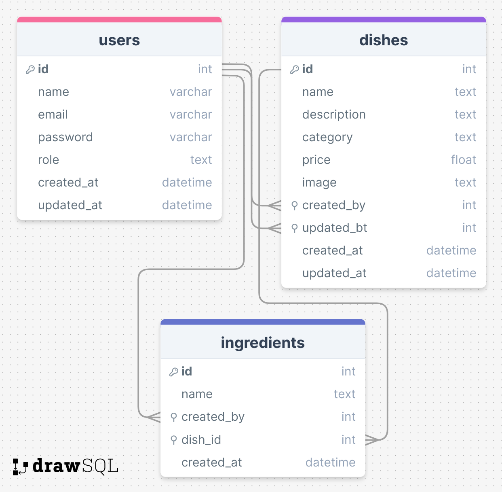

# 

Final Challenge of Rocketseat Explorer, a full-stack formation.

**Food Explorer is a digital menu application for a fictional restaurant, developed to put into practice the back-end and front-end concepts developed during the Explorer formation**

## 🔗 Project Links

- 🚀 [**Deploy**](https://foodexplorer-api-dhrq.onrender.com)
- 🎨 [**Front-end**](https://github.com/emanueltavecia/foodexplorer-web)

## 📋 Project information

- Rocketseat Explorer
- Final challenge

## Registered Users

- Admin user:

  - Email: admin@mail.com
  - Password: 12345

- Customer user:
  - Email: user@mail.com
  - Password: 12345

## Running the project

- Clone the api project:
  ```bash
  git clone https://github.com/emanueltavecia/foodexplorer-api.git
  ```
- Access project folder:
  ```bash
  cd foodexplorer-api
  ```
- Create a `.env` file with the following environment variable:
  ```
  AUTH_SECRET=default
  PORT=3333
  ```
- Install dependencies:
  ```bash
  npm install
  ```
- Run the migrations:
  ```bash
  npm run migrate
  ```
- Run project:
  ```bash
  npm run dev
  ```

## Structure

### Database

The project has a table of users, one of dishes and one of ingredients. See the diagram below to understand better:



### Routes

- The project has the following routes:

  - `'/users'`

    - POST: create a new user:

      ```json
      {
        "name": "User",
        "email": "user@mail.com",
        "password": "12345"
      }
      ```

    - PUT: update user:
      ```json
      {
        "name": "User",
        "email": "user@mail.com",
        "password": "1234",
        "old_password": "12345"
      }
      ```

  - `'/sessions'`

    - POST: create a new session:
      ```json
      {
        "email": "user@mail.com",
        "password": "12345"
      }
      ```

  - `'/dishes'`

    - POST: create a new dish:

      ```json
      {
        "name": "Dish name",
        "description": "Dish description.",
        "category": "Refeição",
        "price": 22,
        "ingredients": ["chocolate", "leite condensado"],
        "image": "image.png"
      }
      ```

    - PATCH: update a dish (`'/dishes/:id'`):

      ```json
      {
        "name": "Dish name",
        "description": "Dish description.",
        "category": "Refeição",
        "price": 22,
        "ingredients": ["chocolate", "leite condensado"],
        "image": "image.png"
      }
      ```

    - GET: all dishes:

      - Param: search

    - GET: a dish (`'/dishes/:id'`)

    -DELETE: a dish (`'/dishes/:id'`)

  - `'/files'`
    - GET: a file (`'/files/:name'`)

## 💻 Technologies


### Dependencies

- bcryptjs
- cookie-parser
- cors
- dotenv
- express
- express-async-errors
- jsonwebtoken
- knex
- multer
- pm2
- sqlite
- sqlite3
- jest
- nodemon

## 📄 License

This project is licensed under the MIT License - see the [LICENSE](./LICENSE) file for more details.
